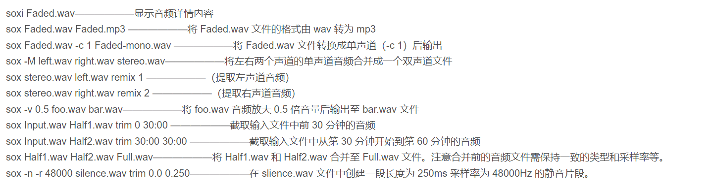

# 安装choco

[Sox安装](https://blog.csdn.net/PeeNut/article/details/81176000)

[基本命令](https://blog.csdn.net/qq_39516859/article/details/87980189)

---

# Sox 录音

1. sox -d Lab1.wav 	录音
2. ctrl+c 停止录音
3. sox --i Lab1.wav 查看音频文件信息
3. 双通道转单通道 sox Lab1.wav -c1 Output1.wav

[Sox ](https://www.youtube.com/watch?v=ozpVfHKmC3Y)

# Part 1

# Matplotlib

[绘图库](https://www.runoob.com/matplotlib/matplotlib-label.html)

[youtube教程](https://www.youtube.com/results?search_query=python+Plot+1%3A+normalised+amplitudes+vs+time+using+a+linear+axis+in+the+time+domain)

[x轴正确](https://blog.csdn.net/qq_36853469/article/details/87942244)

---

# 绘制频域图

[频域](https://pythontechworld.com/article/detail/eoLdts6qrpof)